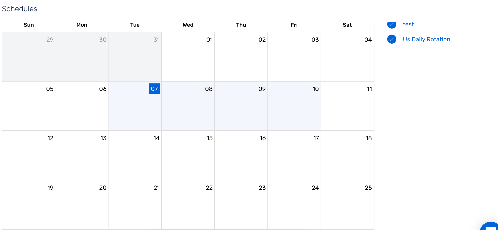
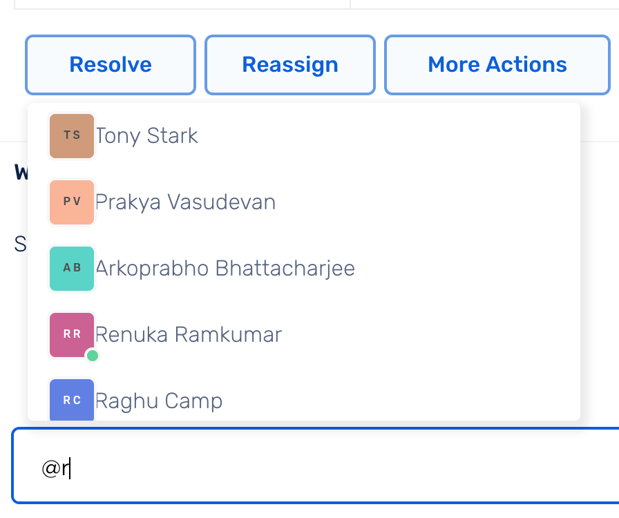
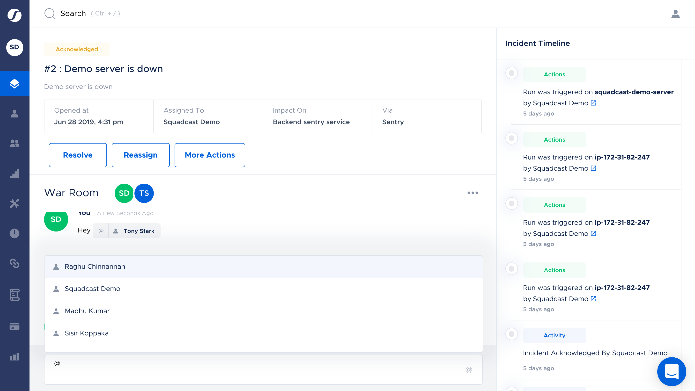

## Squadcast Account

## Squads

### What are Squads?

A Squad is a group of users that can refer to a team or a project. Squads are handy when you need to notify the whole group together. For instance, when coordinated response is required for high-urgency high-complexity incidents, or at the end of an escalation policy when nobody has acknowledged.

### Add or Remove a Squad Member

User can create a Squads under **Squads (Sidebar) → Add Squad**.

Type in a Squad name and add or remove users as needed and Click **Save**. 

## Escalation Policy

Escalation Policies make sure the right people are notified at the right time. The incident notifications can be configured to escalate to Users, Squads or Schedules in a given order and time. You can create different Escalation Policies for different Services. 

### Creating an Escalation Policy

- You can create a Escalation Policy under **Escalation Policies** from the navigation sidebar.

- Click on **Add Escalation Policy** to create one from scratch or choose to edit an existing one by clicking on the **More Options** button for the specific escalation policy.

- Give the Escalation Policy a Name and a Description.

- You can add `Users`, `Squads` or `Schedules` as recipients at any level. 

- Enter the appropriate time, giving enough notice for your recipients to acknowledge the alert after which it will escalate to the next level. 

- You can also choose to override the notifications by turning on the  `Personal Notification Rules` toggle retaining the notification modes of the user's choice. 

- In this case, we have chosen to override the personal notification rules.

## On-call Schedule

Schedules allow you to create time-based rotations/repetitions for on-call schedules. You can see who is on-call on which day with monthly, weekly, daily and agenda views.

{{site.data.alerts.note}}
  
If you have configured routing rules for a service, they will override the schedule and will be given priority.

{{site.data.alerts.end}}

{{site.data.alerts.blue-note}}
<b>Adding Schedules to Escalation Policies</b>
  
Note that you will need to add a created schedule to a service for them to be notified when an incident.

{{site.data.alerts.end}}

### Creating an On-call Shift / Schedule

1.You can create a schedule under **Schedules** → **+** button at the right hand side of the screen.

**Schedule Name**: Give the schedule a name which you can use while adding the on-call schedule to the calendar.

**Schedule Description**: This is a short description of the schedule explaining what it is and why it exists. 

**Schedule Color**: You can also set a color for a specific schedule, which will be used while rendering the on-call on the calendar.

2.You can click on any day of the calendar to create an on-call starting from that day. You can also drag from a day to another to automatically set the *Start date* and *End date*

- Every on-call shift must be a part of some pre-defined schedule. You need to choose which *schedule* you want to create this on-call shift for. 

- Input the *Start date*, *Start time*, *End date* and *End time* to determine when the shift begins and when it ends respectively. 

- Do not check the `Is Override` box if you want to create a normal shift.

- `Repeats`:

    Every Day - Use this to create a daily schedule

    Weekly -- Once a week: Use this to create a schedule that occurs on one day of the week 

    Weekly -- Particular Days Of a Week: Use this to create a schedule that occurs on particular days of the week 

    Custom: Use this to create any other custom schedule of your choice.

In this example we are creating a daily schedule.

Add in the users who would be on call for this shift under the `Assignee Groups` section.
Each group behaves as a different rotation. 

In this example we have two rotations: 

1st rotation - Tony Stark

2nd rotation - BoJack Horseman and Diane Nyugen

- Select the number of shifts after which you want to change the assignee group. 

In this example we have chosen the assignee group after every shift. Since we have picked a daily rotation each day for the specified time interval will be considered one shift. So, every day this schedule will alternate between `Tony Stark`  and `BoJack Horseman and Diane Nyugen`.

{{site.data.alerts.green-note-check}}
<b>Localized Timezones:</b>
  
The selected timezone will default to the local machine timezone. This is especially beneficial for geography-based on-call rotations.   The teams will be able to view any created on-call schedule in their local time.

{{site.data.alerts.end}}

{{site.data.alerts.blue-note}}
<b>Notifications to On-call Team</b>
  
All members in an on-call shift will be notified via email 1 hour before the start of their shift.  
If the created override shift has less than an hour to begin, email notification will go out immediately after creation.

{{site.data.alerts.end}}

### How to use Repetitions

Repetitions can be daily, weekly or monthly. You can customize the number of days/weeks/months you want the on-call to repeat for. You can also restrict the schedules to specific times of the day or during specific days of the week, based on your need.

#### Once a Week 

Check `Weekly -- Once a week` option  to create a schedule that occurs only on one day of the week. 
You can select the day on which this shift will be active.

## APIv2

## Incident Dashboard

The Incident Dashboard is shown as soon as you log in. This is the central console displaying all the incidents which have occurred in your organization and their current status.

You can filter your open incidents or all the open incidents in the organization or only the incidents specific to you using the toggle button at the top. Also, you can use various filters to see incident by status, assignee name, integration type, size, etc.

## Incident Warroom

Incident War Room is an incident specific commenting system where you can add in important notes and pointers that can help mitigate the incident faster. 

You can use this to: 
- Collaborate and resolve the incident 
- Use it to store important pointers that will help with the mitigation 
- Use it to store notes that can be populated in the postmortem report

### Using your War Room During Downtime

- You can add or address Users in the War Room using "@" symbol. This can be used while adding in user specific notes. 

### See Who is On-call

- Users who are on-call at that instant are indicated by a green dot against their name. 

{{site.data.alerts.blue-note}}
<b>Who is On-Call? </b>
  
Users who are on-call across all schedules in the organization are indicated with the green dot.

{{site.data.alerts.end}}

### Markdown Support in War Room

The Incident War Room supports Markdown. 

- You can add in Images as URLs, Links among other important data as a comment within the War Room. 

## Resolve Incident Manually

By clicking on any incident, you will be taken to its dedicated incident page which shows all the details of the incident.

The incident message and number are at the top of the page. It also shows the current status, the incident description, opened time when it got first triggered, to whom it is currently assigned, at what time it got assigned to that Squad or Schedule or any individual user and the service impacted due to the incident. 

It will also have War Room at the bottom and Incident Timeline at the right.

To `Resolve` an incident, click on the **Resolve** button.

## Next Steps

- [Tagging](docs/event-tagging.html)

- [Routing](docs/alert-routing.html)

- [Integrations](docs/circleci-integration.html)

- [Smart Squads](docs/create-smart-squads.html)